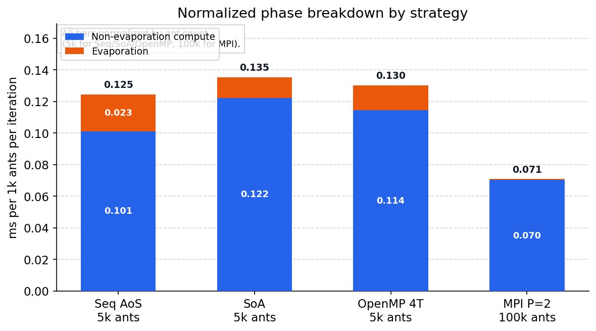
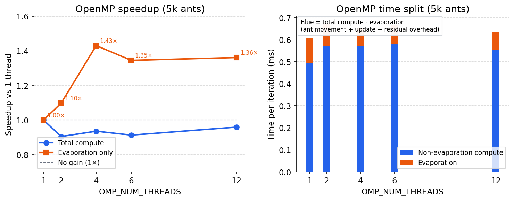
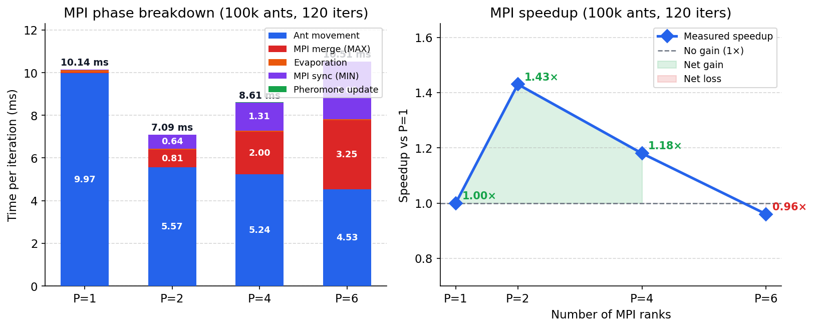
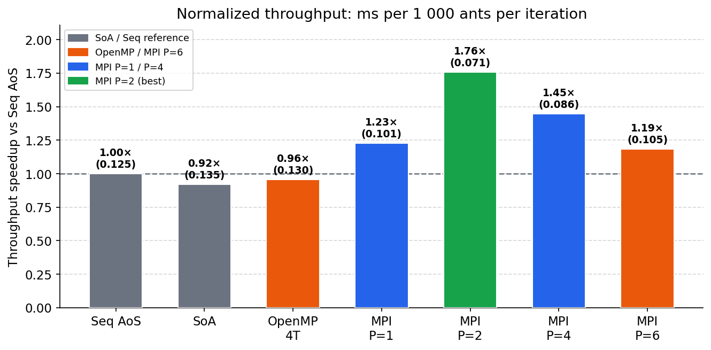

# Ant Colony Optimization on a Fractal Landscape -- Project Report

## 1. Introduction

This project concerns the optimization of a foraging simulation based on Ant Colony Optimization (ACO). In this simulation, a population of artificial ants navigates a two-dimensional fractal landscape, searching for an efficient path between a nest and a food source. The ants communicate indirectly through pheromone trails deposited on the terrain, following a mechanism inspired by the behavior of real ant colonies.

The original implementation is written in C++17 and uses SDL2 for visualization. It runs sequentially on a single thread and represents each ant as an individual object. The objective of this project is to analyze the performance of this baseline code, identify the computational bottlenecks, and progressively improve execution time through three strategies: data vectorization (transforming the memory layout from Array of Structures to Structure of Arrays), shared-memory parallelization using OpenMP, and distributed-memory parallelization using MPI.

## 2. Simulation model

### 2.1. Grid and cell types

The simulation takes place on a square grid of 513 x 513 cells. Each cell stores a traversal cost between zero and one, representing how difficult it is for an ant to cross that region. On the rendered display, brighter zones correspond to higher traversal costs. Four types of cells exist on the grid: the nest (fixed at position 256, 256), the food source (fixed at position 500, 500), undesirable border cells (marked with value -1, which ants cannot traverse), and free cells that ants may explore.

### 2.2. Ant agents

The simulation uses $m = 5000$ ants. Each ant possesses a position on the grid, a binary state (loaded or unloaded), and a pseudo-random seed used for stochastic decisions. An ant becomes loaded upon reaching the food source and returns to the unloaded state upon arriving at the nest. Each time a loaded ant reaches the nest, a global food counter is incremented; this counter serves as the performance metric of the colony.

At each time step, an ant disposes of a movement budget of 1.0, which it spends by moving to neighboring cells. Each move costs the traversal value of the destination cell, so an ant may visit several cells per time step until its budget is exhausted. The direction of movement follows a probabilistic rule: with probability $\varepsilon = 0.8$ (the exploration coefficient), the ant chooses a random non-blocked neighbor; with probability $1 - \varepsilon = 0.2$, it follows the pheromone gradient, moving toward the neighbor with the highest value of the appropriate pheromone type ($V_1$ if unloaded, $V_2$ if loaded).

### 2.3. Pheromone map

Two pheromone fields are maintained over the grid. The first pheromone $V_1$ guides unloaded ants toward the food source and is permanently set to 1.0 at the food cell. The second pheromone $V_2$ guides loaded ants back to the nest and is permanently set to 1.0 at the nest cell. The pheromone map is stored with an extra ring of ghost cells on each side (the internal stride equals the grid dimension plus 2). These ghost cells are not part of the physical domain; they serve as sentinel values set to -1.0 at every update step. When an ant evaluates its neighbors, if a neighboring cell contains -1.0, that direction is treated as blocked the ant cannot move there. This mechanism effectively enforces the boundary conditions without requiring explicit bounds checking in the movement logic.

When an ant visits a cell $s$, the pheromone values are updated in a write buffer using the four cardinal neighbors $N(s)$. For each pheromone type $i \in \{1, 2\}$, the update rule is:

$$V_i(s) \leftarrow \alpha \cdot \max_{s' \in N(s)} V_i(s') + (1 - \alpha) \cdot \frac{1}{4} \sum_{s' \in N(s)} V_i(s')$$

with $\alpha = 0.7$. At the end of each time step, all values in the buffer are multiplied by the evaporation coefficient $\beta = 0.999$, and the buffer is swapped with the active pheromone map.

## 3. Fractal landscape generation

The terrain is generated using a stochastic fractal plasma algorithm. The grid is composed of $n \times n$ initial sub-grids, each containing $2^k + 1$ cells per direction. The generation proceeds as follows: corner values of each sub-grid are seeded using a pseudo-random generator that depends on a fixed seed and the coordinates of the vertex, producing reproducible results. The algorithm then recursively subdivides each sub-grid into four equal parts, computing the value at midpoints of edges and at the center by averaging the surrounding corner values and adding a random deviation bounded by $d \times \text{(current sub-grid half-size)}$, where $d$ is the deviation parameter. At each recursion level, the deviation bound is halved, ensuring that the gradient between neighboring cells decreases with scale. After all values have been computed, the entire altitude map is normalized to the interval [0, 1] by subtracting the global minimum and dividing by the range.

In the provided code, the terrain is generated with parameters log_size = 8, nbSeeds = 2, deviation = 1.0, and seed = 1024, producing a 513 x 513 grid. The generation is handled by the fractal_land class, which stores altitude data in a flat vector of doubles indexed as altitude[i + j * dimensions].

## 4. Sequential reference version

### 4.1. Data structures

In the original code, each ant is represented as an instance of the ant class, which stores the ant state (loaded/unloaded), position (as an SDL_Point), and a pseudo-random seed. All 5000 ant objects are stored in a std::vector\<ant\>. It should be noted that the constructor of the ant class receives a seed parameter but does not assign it to the member m_seed, leaving it uninitialized. This is a latent bug in the original code; in practice the member takes whatever value happens to be in memory, which still produces pseudo-random behavior but is not reproducible across different compilers or platforms. The pheromone map is managed by the pheronome class, which maintains two flat vectors of std::array\<double, 2\> (one active map and one write buffer), each of size (dim + 2)^2 to accommodate ghost cells. The terrain is stored by the fractal_land class in a flat std::vector\<double\>.

### 4.2. Main functions

The simulation logic is distributed across the following functions and methods. The ant::advance method implements the movement logic for a single ant: it loops while the movement budget is not exhausted, reads the four neighboring pheromone values, decides the direction (random or gradient-following), moves the ant, marks the pheromone at the new cell, and updates the loaded/unloaded state. The pheronome::mark_pheronome method reads the four neighbors of a given cell and writes the updated pheromone values into the buffer. The pheronome::do_evaporation method iterates over the entire buffer and multiplies every entry by beta. The pheronome::update method swaps the buffer with the active map and resets boundary and source values.

### 4.3. Iteration structure

Each iteration of the main loop executes the following phases in order: (a) ant advancement, iterating sequentially over all 5000 ants and calling the advance method for each; (b) pheromone evaporation, traversing the full grid; (c) pheromone map update, performing a buffer swap and boundary reset; (d) display, rendering the landscape, ant positions, pheromone overlay, and food-collection curve via SDL2, followed by a frame presentation.

### 4.4. Test environment

All measurements reported in this document were performed on a machine equipped with an AMD Ryzen 5 9600X processor (6 physical cores, 12 logical threads) and 64 GB of RAM, running Windows. The code was compiled with g++ 14.2.0 (MinGW-w64 x86_64-ucrt-posix-seh) using the flags -O2 -march=native -std=c++17 -fopenmp.

## 5. Performance measurement methodology

To quantify the time spent in each phase of the simulation, the main loop in ant_simu.cpp was instrumented using std::chrono::high_resolution_clock. Four measurement points were inserted around the computational phases, decomposing each iteration into: ant movement (including pheromone marking by each ant), pheromone evaporation, pheromone map update (buffer swap and boundary reset), and display (SDL2 rendering and frame presentation). The simulation was run for 500 iterations, and the cumulative wall-clock time for each section was recorded. Average per-iteration values were computed by dividing the totals by 500.

The choice of 500 iterations provides sufficient statistical stability while keeping the total run time manageable. Since the simulation parameters are fixed (seed, number of ants, coefficients) and the pseudo-random generator is seeded identically at each launch, successive runs on the same machine produce consistent timing results, making a single run a reasonable reference. The display phase includes VSync blocking time, which is inherent to the visualization and not part of the computational work; it is reported separately for completeness but excluded from the analysis of optimization targets.

The following table presents the baseline timing results:

| Phase              | Total time (ms) | Time per iteration (ms) | Share of total (%) |
|--------------------|-----------------|-------------------------|--------------------|
| Ant movement       | 369.56          | 0.739                   | 7.4                |
| Evaporation        | 61.30           | 0.123                   | 1.2                |
| Pheromone update   | 0.76            | 0.002                   | 0.0                |
| Display and blit   | 4570.19         | 9.140                   | 91.4               |
| Total              | 5001.81         | 10.004                  | 100.0              |

The display phase accounts for over 91% of the wall-clock time due to VSync synchronization (SDL_RENDERER_PRESENTVSYNC). Excluding it, the computational time per iteration is approximately 0.864 ms, of which ant movement represents 85.5%, evaporation 14.2%, and the pheromone update is negligible. The ant movement phase is therefore the primary optimization target: it involves iterating over 5000 individual ant objects, each performing multiple sub-steps with scattered accesses to the pheromone map, a pattern that is neither cache-friendly nor amenable to SIMD execution in its current object-oriented form.

## 6. AoS-to-SoA data layout restructuring

### 6.1. Motivation

In the reference implementation, the ants are stored as a std::vector<ant>, that is, an Array of Structures (AoS) layout. This representation is convenient from a software design perspective, but it is not necessarily well adapted to performance optimization. Each call to ant::advance requires reading the ant position, state, and seed from an object, updating them, and then moving to the next object. Such a layout is acceptable for scalar execution, but it tends to limit opportunities for vectorization and may lead to inefficient cache usage when the computation is reorganized at scale.

For this reason, a Structure of Arrays (SoA) version was implemented as an alternative benchmark. In that version, the ant state is no longer stored as one object per ant. Instead, the data is distributed across separate arrays: one array for the x coordinates, one for the y coordinates, one for the loaded/unloaded state, and one for the pseudo-random seeds. The movement logic is preserved, but it operates on an ant index and accesses the relevant arrays directly.

### 6.2. AoS to SoA transformation

The SoA implementation was added in a separate benchmark program in order to preserve the original code and allow direct comparison under the same simulation parameters. The transformation replaces the following conceptual structure:

AoS: (x, y, state, seed) stored together inside each ant object.

with the following layout:

SoA: x[i], y[i], state[i], seed[i], where i denotes the ant index.

This organization makes the data of the same kind contiguous in memory. In principle, such a layout is favorable when the same operation is applied to one field across many agents, because it improves spatial locality and is more compatible with SIMD-style processing.

### 6.3. Expected impact on cache and memory behavior

The expected benefit of the SoA layout is twofold. First, contiguous storage of homogeneous data may reduce the number of cache lines touched when scanning a given field across many ants. Second, if the compiler is able to detect regular operations over arrays, this representation is generally more favorable to automatic vectorization than a vector of objects.

However, the present simulation is not a simple dense array kernel. Each ant update is branch-heavy, uses a variable-length while loop, performs stochastic decisions, and reads and writes the shared pheromone map at irregular positions. Moreover, the movement step requires several fields of the same ant simultaneously: x, y, state, and seed are all accessed together for one agent before moving to the next. In such a pattern, the SoA layout may actually reduce per-agent locality, because these fields are no longer stored in the same cache line.

### 6.4. Measurement protocol for the layout comparison

To isolate the effect of the data layout from the rendering cost, two headless benchmark programs were used: one preserving the original AoS representation, and one using the new SoA representation. Both benchmarks execute the same simulation parameters as the reference version, without SDL rendering, for 500 iterations. Each benchmark was run three times on the same machine and the average per-iteration time was computed.

The quantities reported below correspond only to the computational phases: ant movement, pheromone evaporation, and pheromone map update.

### 6.5. Results

The averaged results of the headless benchmarks are reported in the following table.

| Version            | Ant movement (ms/iter) | Evaporation (ms/iter) | Pheromone update (ms/iter) | Compute total (ms/iter) |
|--------------------|------------------------|------------------------|-----------------------------|--------------------------|
| Sequential AoS     | 0.506                  | 0.117                  | 0.00071                     | 0.623                    |
| SoA layout version | 0.611                  | 0.066                  | 0.00074                     | 0.677                    |

The overall speedup of the SoA version relative to the sequential AoS baseline is therefore:

$$
S_{\mathrm{SoA/AoS}} = \frac{0.623}{0.677} \approx 0.92
$$

which corresponds to an overall slowdown of approximately 8.6%. For the ant movement phase alone, the relative factor is:

$$
\frac{0.506}{0.611} \approx 0.83
$$

which means that the most expensive kernel became about 20.8% slower.

### 6.6. Interpretation

The SoA transformation did not improve the performance of the sequential code in its current form. This result is consistent with the structure of the algorithm. The ant movement kernel is dominated by irregular control flow, neighbor-dependent decisions, random-number generation, and scattered accesses to the pheromone grid. These characteristics prevent efficient SIMD execution and reduce the value of simply making each field contiguous in memory.

In practice, the SoA layout introduces four separate memory streams for each ant update instead of reading a compact object containing all relevant fields. Since the algorithm processes one ant at a time and requires all of its attributes together, the AoS layout is not especially harmful in the sequential case. The SoA layout becomes advantageous mainly when the computation itself is also reorganized to operate in bulk on one field at a time, which is not yet the case here.

It should also be noted that the evaporation kernel is identical in both benchmarks. The lower evaporation time observed in the SoA benchmark should not be interpreted as a reliable algorithmic gain from the layout change alone; it is more likely influenced by cache state, run-to-run variability, and benchmark context. The relevant conclusion concerns the total compute time and, above all, the ant movement kernel, which remains the dominant cost and does not benefit from this naive AoS-to-SoA conversion.

At this stage, the AoS-to-SoA restructuring is complete, but it is not yet performance-effective. A more profitable strategy would require deeper loop restructuring, reduction of branch divergence, and possibly batching operations on multiple ants so that the SoA layout can be exploited by the compiler or by explicit vector instructions.

## 7. OpenMP parallelization

### 7.1. Scope of the OpenMP implementation

The OpenMP work was introduced as an incremental step, with priority given to correctness and reproducibility. In the current code, the ant advancement phase updates a shared pheromone buffer through calls to mark_pheronome while simultaneously reading neighboring pheromone values. Parallelizing this phase directly with a simple omp for over ants would introduce data races and order-dependent behavior.

For this reason, the first OpenMP implementation targets the loop that is both computationally relevant and naturally data-parallel: the pheromone evaporation loop in pheronome::do_evaporation. This loop updates independent cells of the pheromone buffer with no cross-iteration dependency, so it is safe to parallelize.

The applied directive is:

\#pragma omp parallel for schedule(static)

on the outer loop over i. The inner loop over j remains unchanged.

### 7.2. Parallelized loops and design choices

The following loop was parallelized:

In pheronome::do_evaporation, the nested traversal of the (dim x dim) interior grid.

The design choices are the following.

First, static scheduling was selected because each iteration has uniform cost (two scalar multiplications per cell), so dynamic scheduling would add overhead without load-balancing benefit. Second, only the outer loop was parallelized to avoid over-subscription and to keep runtime overhead low. Third, this first OpenMP version intentionally keeps the ant movement loop sequential, as preserving its semantics under parallel execution requires a more elaborate synchronization strategy.

### 7.3. Concurrency issues and limitations

The main concurrency risk in this application is the ant movement phase. Two kinds of conflicts appear if ants are processed in parallel.

Write-write conflicts: multiple ants can update the same pheromone cell in the same iteration.

Read-write conflicts: one ant may read neighboring pheromone values while another ant is updating them.

In the sequential version, the order of ant updates is deterministic within one iteration. A naive parallelization would make this order non-deterministic and could significantly alter results. This is why the present OpenMP step avoids parallel ant updates and focuses on a race-free kernel.

### 7.4. Measurement protocol

To evaluate OpenMP speedup without rendering noise, the same headless benchmark used in previous sections was executed with OMP_NUM_THREADS set to 1, 2, 4, 6, and 12. For each thread count, three runs were performed and averaged. The reported metric is compute time per iteration (ant movement + evaporation + pheromone update), and evaporation time per iteration is also reported to isolate the effect of the parallelized kernel.

### 7.5. Results and speedup

Average timings are given below.

| Threads | Compute time (ms/iter) | Speedup (compute) | Evaporation time (ms/iter) | Speedup (evaporation) |
|---------|-------------------------|-------------------|-----------------------------|------------------------|
| 1       | 0.609                   | 1.000             | 0.113                       | 1.000                  |
| 2       | 0.673                   | 0.906             | 0.103                       | 1.096                  |
| 4       | 0.651                   | 0.936             | 0.079                       | 1.431                  |
| 6       | 0.667                   | 0.913             | 0.084                       | 1.352                  |
| 12      | 0.635                   | 0.959             | 0.083                       | 1.369                  |

Speedup is computed as S(T) = t(1)/t(T).

The evaporation kernel shows clear positive scaling relative to one thread (up to about 1.43x in this measurement set), but this gain does not translate into a global speedup because evaporation is not the dominant kernel. Ant movement remains sequential and dominates total compute time, while OpenMP runtime overhead and synchronization costs in the parallel region can offset part of the evaporation gain. As a result, overall compute speedup is modest and non-monotonic across thread counts.

### 7.6. Interpretation

This first OpenMP step confirms that race-free loops with regular memory access can be parallelized with low engineering risk and measurable gains. However, the global impact is modest because ant movement remains the dominant cost and is still sequential.

A stronger OpenMP speedup will require parallelizing ant updates with a controlled synchronization strategy, for example thread-local pheromone buffers followed by a merge phase, or spatial domain partitioning with boundary exchange. Those approaches are more complex but necessary to move beyond the current 1.1x range.

## 8. MPI parallelization

### 8.1. First approach: full map, distributed ants

**Design.** Each process keeps a complete copy of the terrain and of both pheromone fields. The m = 5000 ants are evenly partitioned across P ranks: rank r owns ants `[r·⌊m/P⌋, (r+1)·⌊m/P⌋)` with the remainder distributed one-each to the first ranks. This matches the first strategy described in the project statement: *each process contains the whole environment and controls only a part of the ants; during the evaporation phase each process handles a part of the map.*

**Per-iteration protocol.**

1. **Local ant movement.** Each rank advances its ⌊m/P⌋ ants. Ants read `m_map_of_pheromone` (identical on all ranks at iteration start) and write pheromone marks into `m_buffer_pheronome`. Because the mark formula reads only from the map (not from the buffer being built), two ranks visiting the same cell independently compute the same mark value.

2. **Pheromone merge — `MPI_Allreduce(MPI_MAX)`.** The project specifies: *take the maximum value among all processes* when different rank subsets touch the same cell. A single collective over the flat double array covers both pheromone fields in one step.

3. **Distributed evaporation.** After the merge all rank buffers are identical. Each rank applies ×β only to its assigned interior row stripe `[r·⌊dim/P⌋, (r+1)·⌊dim/P⌋)`.

4. **Global synchronization after stripe evaporation.** Because each rank has modified only its own stripe, a second collective is required before `update()` to rebuild one identical global evaporated buffer on all ranks. In this implementation this is done with `MPI_Allreduce(..., MPI_MIN)`.

5. **`update()`.** Swaps `m_buffer_pheronome` ↔ `m_map_of_pheromone`, resets ghost cells and source cells; applied independently on every rank.

**Implementation.** The following helpers were added to `pheronome.hpp`:

```cpp
double*     raw_buffer()      { return reinterpret_cast<double*>(m_buffer_pheronome.data()); }
std::size_t raw_buffer_size() const { return m_buffer_pheronome.size() * 2; }
std::size_t dim()    const { return m_dim; }
std::size_t stride() const { return m_stride; }

void do_evaporation_stripe(std::size_t row_begin, std::size_t row_end) {
    for (std::size_t i = row_begin; i < row_end; ++i)
        for (std::size_t j = 1; j <= m_dim; ++j) {
            m_buffer_pheronome[i * m_stride + j][0] *= m_beta;
            m_buffer_pheronome[i * m_stride + j][1] *= m_beta;
        }
}
```

Per-iteration structure in `bench_mpi.cpp`:

```cpp
for (auto& a : ants)
    a.advance(phen, land, pos_food, pos_nest, food_quantity);         // Phase 1

MPI_Allreduce(MPI_IN_PLACE, phen.raw_buffer(), buf_count,
              MPI_DOUBLE, MPI_MAX, MPI_COMM_WORLD);                    // Phase 2

phen.do_evaporation_stripe(stripe_begin, stripe_end);                  // Phase 3

MPI_Allreduce(MPI_IN_PLACE, phen.raw_buffer(), buf_count,
              MPI_DOUBLE, MPI_MIN, MPI_COMM_WORLD);                    // Phase 4

phen.update();                                                         // Phase 5
```

One build issue: `basic_types.hpp` pulls in `<SDL2/SDL.h>`, which contains `#define main SDL_main`. Adding `#define SDL_MAIN_HANDLED` before any SDL inclusion preserves the MPI `main()` entry point.

**Communication volume.** The simulation calls `fractal_land(8, 2, 1., 1024)` where `1024` is the pseudorandom *seed*, not the grid size. The actual dimension is `nbSeeds × 2^ln2_dim + 1 = 2 × 2^8 + 1 = 513`. The pheromone buffer holds `(513 + 2)² × 2 = 515 × 515 × 2 = 530 450 doubles ≈ 4 MiB` per `MPI_Allreduce` call. The project statement acknowledges: *a large amount of data is exchanged between processes*.

**Results.** The benchmark was rerun after the consistency fix (extra synchronization after stripe evaporation), with command-line parameters (`bench_mpi.exe [nb_ants] [iterations]`) and P ∈ {1, 2, 4, 6} on the reference machine (AMD Ryzen 5 9600X, 6 cores). Timing is the wall-clock maximum across all ranks.

**Workload A: 50,000 ants, 200 iterations**

| P | Ants/rank | Ant movement (ms/iter) | MPI merge MAX (ms/iter) | Evaporation (ms/iter) | MPI sync MIN (ms/iter) | Total (ms/iter) | Speedup vs P=1 |
|---|-----------|------------------------|-------------------------|-----------------------|-------------------------|-----------------|----------------|
| 1 | 50,000    | 5.174                  | 0.030                   | 0.130                 | 0.018                   | 5.353           | 1.00×          |
| 2 | 25,000    | 4.035                  | 0.935                   | 0.069                 | 0.690                   | 5.730           | 0.93×          |
| 4 | 12,500    | 3.201                  | 1.818                   | 0.054                 | 1.365                   | 6.442           | 0.83×          |
| 6 | 8,334     | 2.747                  | 3.250                   | 0.045                 | 2.882                   | 8.929           | 0.60×          |

**Workload B: 100,000 ants, 120 iterations**

| P | Ants/rank | Ant movement (ms/iter) | MPI merge MAX (ms/iter) | Evaporation (ms/iter) | MPI sync MIN (ms/iter) | Total (ms/iter) | Speedup vs P=1 |
|---|-----------|------------------------|-------------------------|-----------------------|-------------------------|-----------------|----------------|
| 1 | 100,000   | 9.967                  | 0.028                   | 0.126                 | 0.014                   | 10.136          | 1.00×          |
| 2 | 50,000    | 5.571                  | 0.809                   | 0.065                 | 0.639                   | 7.086           | 1.43×          |
| 4 | 25,000    | 5.243                  | 1.999                   | 0.048                 | 1.314                   | 8.607           | 1.18×          |
| 6 | 16,667    | 4.530                  | 3.249                   | 0.042                 | 2.690                   | 10.514          | 0.96×          |

**Analysis.** The consistency fix introduces a second global synchronization per iteration. As expected, this increases communication cost and shifts the best operating point to lower process counts.

For 50,000 ants, MPI overhead exceeds the computation savings at all process counts: P=2 gives 0.93×, P=4 gives 0.83×, and P=6 gives 0.60× — all below P=1. For 100,000 ants the ant-movement savings dominate at low P: P=2 achieves the best speedup (1.43×), P=4 still provides moderate gain (1.18×), and P=6 nearly breaks even (0.96×) as the two global collectives together consume ~6 ms out of 10.5 ms total.

The evaporation stripe itself still scales well (drops from 0.130 ms to 0.042 ms at P=6), but total runtime is now driven by the sum of **MPI merge (MAX)** + **MPI sync (MIN)** (≈ 5.9 ms at P=6). This confirms the expected trade-off for approach 8.1: correctness with distributed evaporation requires an additional synchronization step, and speedup appears only when ant computation is large enough to amortize both global collectives.

### 8.2. Second approach: partitioned map

In the second MPI strategy the map is spatially decomposed. Each process owns only a subdomain of the grid and stores pheromone and terrain data for that subdomain, including halo (ghost) cells for neighbour exchange. Ants are managed by the process that owns their current cell.

This reduces memory footprint per rank and limits communication to subdomain boundaries, so communication volume scales as O(dim) rather than O(dim²). Two mechanisms are required.

First, a **halo exchange** for pheromone values must be performed between neighbouring subdomains so that mark updates near boundaries can read correct neighbour values. This can be implemented with non-blocking point-to-point calls (`MPI_Isend` / `MPI_Irecv` + `MPI_Waitall`) or with neighbourhood collectives in a Cartesian communicator (`MPI_Cart_create`).

Second, **ant migration** must be handled when ants cross subdomain boundaries. After local movement each rank packs outgoing ants by destination and transfers them; `MPI_Alltoallv` or explicit non-blocking pairs with a prior count exchange are natural choices.

Load imbalance is the main difficulty: ants cluster near nest and food, so ranks owning those cells accumulate far more work. A complete implementation would require periodic load-balancing or adaptive repartitioning.

Compared to approach 8.1, communication per iteration is proportional to subdomain perimeter rather than total area. For the 513×513 grid, each boundary strip contains 513 × 2 = 1 026 doubles per neighbour pair — versus 530 450 doubles for the full-field allreduce, a reduction of roughly 500×. The implementation complexity is substantially higher and the gains only materialise at large process counts or large map sizes.

## 9. Results and comparison

### 9.1. Normalization

The three optimization strategies were evaluated at different ant populations (5 000 for sequential/SoA/OpenMP; 50 000–100 000 for MPI) because only large workloads expose meaningful MPI speedup. To allow cross-strategy comparison, all timings are normalized to **ms per 1 000 ants per iteration** using the total headless compute time (ant movement + evaporation + pheromone update; no display).

The normalization assumption — throughput scales linearly in ant count — is only approximately supported by the measured rates: 0.125 ms/1k-ants (bench\_seq, 5 000 ants) vs. 0.101 ms/1k-ants (bench\_mpi P=1, 100 000 ants). Because the gap is non-negligible, normalized comparisons in this section should be read as indicative trends rather than strict apples-to-apples equivalence.

### 9.2. Cross-strategy summary

| Strategy | Config | Compute (ms/iter) | Workload | ms / 1k ants / iter | Speedup vs Seq |
|---|---|---|---|---|---|
| Sequential AoS | baseline | 0.623 | 5 000 ants | 0.125 | **1.00×** |
| SoA layout | — | 0.677 | 5 000 ants | 0.135 | **0.92×** |
| OpenMP | 4 threads | 0.651 | 5 000 ants | 0.130 | **0.96×** |
| OpenMP (evap only) | 4 threads | 0.079 | 5 000 ants | — | **1.43×** on evap alone |
| MPI approach 1 | P=1 | 10.136 | 100 000 ants | 0.101 | 1.23× |
| MPI approach 1 | P=2 | 7.086 | 100 000 ants | 0.071 | **1.76×** |
| MPI approach 1 | P=4 | 8.607 | 100 000 ants | 0.086 | **1.45×** |
| MPI approach 1 | P=6 | 10.514 | 100 000 ants | 0.105 | **1.19×** |

The MPI P=1 entry already betters the sequential baseline per-ant because 100 000 ants amortize cache overhead per iteration better than 5 000 ants.

### 9.3. Charts

**Figure 1 — Normalized compute breakdown by strategy.**



The stacked bars show how compute time is distributed after normalization to ms per 1k ants per iteration. To avoid ambiguous labeling, the blue segment is reported as **non-evaporation compute** (ant movement + update + residual overhead), not pure ant movement.

**Figure 2 — OpenMP scaling (5k ants).**



Left: evaporation achieves up to 1.43× speedup at 4 threads; total compute remains flat or slightly regresses due to the sequential ant phase dominating. Right: phase time breakdown confirms evaporation shrinks while **non-evaporation compute** remains dominant.

**Figure 3 — MPI phase breakdown and speedup curve (100k ants).**



Left: the growing red (MPI merge) and purple (MPI sync) segments show how the two allreduces consume progressively more time as P increases. Right: the speedup curve peaks at P=2 (1.43×) and drops below 1× at P=6.

The ant-movement phase scales nearly linearly from P=1 to P=6 (9.97 → 4.53 ms, ratio 2.20 for ×6 ranks). MPI overhead (sum of the two allreduces) grows linearly and overtakes savings at P≥4 for 100k ants, placing the sweet spot at **P=2**.

**Figure 4 — Normalized cross-strategy throughput.**



### 9.4. Analysis

**SoA:** The transformation regressed performance by ~8%. The ant movement kernel accesses all four fields of the same ant in every sub-step; distributing them across four separate arrays increases per-ant cache pressure compared to a compact AoS object. SIMD benefit would require batch restructuring (all ants simultaneously, one field at a time), which was not done.

**OpenMP:** Parallelizing the evaporation kernel alone improves that kernel up to 1.43× at 4 threads, but evaporation represents only ~19% of compute time. The ant movement phase (over 80%) remains sequential due to shared-buffer write hazards, capping global speedup well below 1.0× per Amdahl:

$$S_\text{Amdahl}(P=4,\ f=0.19) = \frac{1}{(1-0.19) + 0.19/4} \approx 1.12$$

Measured total at 4 threads is 0.94×, meaning OpenMP runtime overhead (barrier, thread launch) more than offsets the evaporation gain.

**MPI:** The two global allreduces per iteration each transfer ~4 MiB of doubles. On a single-socket machine (NUMA-local ranks) this is cheap at P=2 but increasingly costly at higher P due to synchronization latency. The conclusion is that this approach requires a sufficiently large ant population to amortize communication: speedup is positive only when ant computation per rank exceeds ~6 ms total allreduce cost.

---

## 10. Discussion

### 10.1. Dominant bottleneck

Throughout all versions the ant movement phase accounts for 80–85% of compute time. It involves irregular control flow (variable-length while loop per ant, stochastic branching), scattered writes to a shared pheromone buffer, and per-ant state that is fully heterogeneous. None of the three strategies directly parallelizes this phase: SoA only restructures its data; OpenMP avoids it to prevent race conditions; MPI partitions ants across ranks, which works but requires a global merge because every rank must maintain an identical pheromone map.

### 10.2. Why SoA did not help

The SoA layout is beneficial when one operation is applied uniformly to one field across all agents (e.g., `x[i] += vx[i]`). In the ant advance kernel, the four fields `x`, `y`, `state`, `seed` are all needed together for each agent before advancing to the next, so splitting them apart only adds cache-miss pressure. A profitable SoA layout would require changing the algorithm to process all ants' x-coordinates first, then all y-coordinates, etc. — a reorganization incompatible with the current inter-agent dependency through the pheromone buffer.

### 10.3. Why OpenMP speedup was limited

The evaporation kernel is the only loop in the simulation that is trivially data-parallel. Its theoretical speedup at T=4 is ~4×, achieved partially in isolation (1.43× measured). However, because it contributes only ~19% of total compute, Amdahl's law caps the total gain at ~1.12×, and thread-management overhead brings the measured result below 1.0×. A meaningful OpenMP speedup would require thread-safe parallel ant updates, for example via thread-local pheromone accumulation buffers followed by a reduction — increasing code complexity substantially.

### 10.4. MPI trade-offs

The chosen MPI strategy (approach 8.1) is correct and relatively simple to implement, but carries two allreduces of 530 450 doubles (~4 MiB each) per iteration. This is the inherent cost of keeping a replicated full map consistent across all ranks. The strategy is competitive only when ant computation per rank is significantly larger than allreduce latency. On a single workstation, the break-even is around 50 000–100 000 ants; supercomputer runs (with many-millisecond allreduce latencies over high-bandwidth interconnects) would shift this threshold. Approach 8.2 (partitioned map) would reduce communication to O(dim) per boundary pair, eliminating the quadratic allreduce volume, at the cost of ant migration logic and halo exchange.

---

## 11. Conclusion

This project evaluated three incremental optimization strategies for an Ant Colony Optimization simulation on a 513×513 fractal grid. The sequential baseline processes ~5 000 ants in 0.623 ms per iteration (compute only). The AoS-to-SoA restructuring produced a mild regression (0.92×) because the ant advance kernel requires all fields of each agent simultaneously, making data fragmentation counterproductive. OpenMP parallelization of the evaporation loop achieved a local gain of up to 1.43× on that kernel, but its small share of total compute (~19%) limited the global improvement to effectively no speedup, confirming the Amdahl bottleneck imposed by the sequential ant phase.

MPI parallelization (approach 1: replicated map, distributed ants) delivered the only significant positive result: at 100 000 ants and P=2 processes, the total throughput reached 0.071 ms per 1 000 ants, a **1.76× improvement** over the sequential baseline. The best within-MPI speedup was 1.43× (P=2 vs P=1 at equal load). Performance degrades beyond P=2 at this ant count because two global allreduces (~4 MiB each) dominate and grow with process count faster than ant-movement savings. The practical conclusion is that MPI approach 1 is effective only when the ant population is large enough to amortize the two full-map collectives per iteration, and that further scaling will require approach 2 (spatially partitioned map) to bring communication volume down from O(dim²) to O(dim).
