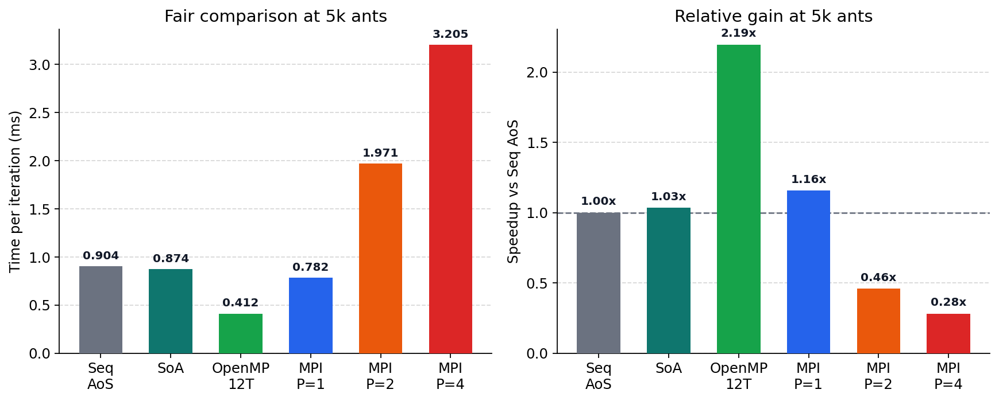
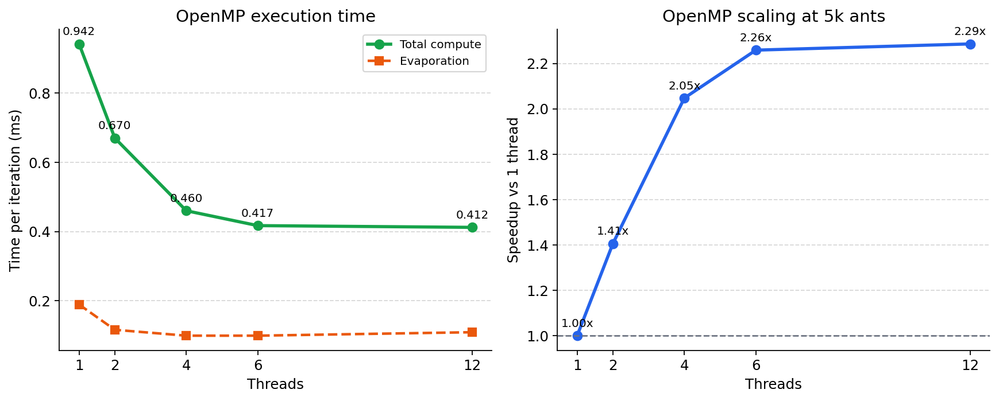
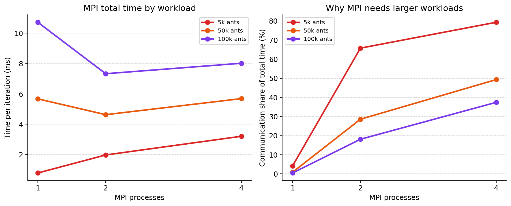

# Optimization of an ant-colony simulation on a fractal terrain

## 1. Introduction

This work studies the optimization of a foraging simulation inspired by ant colonies. The domain is a 513 x 513 two-dimensional grid containing a food source, a nest, and two pheromone values per cell. At each iteration, the ants move on the grid, update the pheromone buffer, and then evaporation and map swapping are applied.

The objective was to evaluate three optimization strategies: data-layout reorganization, shared-memory parallelization with OpenMP, and distributed-memory parallelization with MPI. All comparisons were made with headless benchmarks, without SDL rendering, in order to measure only the computational cost. The tests were executed on an AMD Ryzen 5 9600X with 64 GB of RAM, running Windows, compiled with g++ 14.2.0 and the flags `-O2 -march=native -std=c++17 -fopenmp`.

During the work, two correctness issues in the original code were also fixed. The first concerned the pseudo-random seed of each ant, which was not initialized correctly. The second concerned the pheromone buffer, which had to be rebuilt from the active map after each update in order to avoid reusing stale values.

## 2. Reference version

The original simulation uses an AoS representation for the ants, that is, a vector of `ant` objects. Each object stores position, state, and seed. At each iteration, the dominant cost is the ant-movement phase. This part combines variable-length loops, stochastic decisions, and irregular accesses to the pheromone grid. For this reason, it accounts for most of the execution time and is the main optimization target.

For the headless measurements of the sequential version, `OMP_NUM_THREADS=1` was used and each benchmark was run ten times. Table 1 reports the averages per iteration.

| Phase | Average time (ms/iter) |
|------|-------------------------|
| Ant movement | 0.634 |
| Evaporation | 0.186 |
| Map update | 0.085 |
| Total compute time | 0.904 |

Even without the graphical part, ant movement remains the dominant phase. This observation guided the optimization choices made in the following sections.

## 3. Data-layout reorganization

The first vectorization attempt only separated `x`, `y`, state, and seed into independent arrays. This change alone was not sufficient, because the algorithm still processed one ant at a time and still needed all four fields together. In practice, this increased memory fragmentation without changing the structure of the computation.

In the revised version, the data layout was reorganized to follow the actual access pattern of the kernel more closely. Instead of storing only coordinates, the code uses linear indices for the terrain and pheromone maps, together with state and seed. As a result, ant movement is expressed through simple increments that are consistent with the linear layout of the arrays. In addition, the cells visited during an iteration are recorded, and the pheromone buffer is updated at the end of the phase, once per touched cell. This removes redundant work from the critical path.

To compare AoS and SoA, ten pairs of runs were performed with `OMP_NUM_THREADS=1`. Table 2 shows the averages.

| Version | Movement (ms/iter) | Evaporation (ms/iter) | Update (ms/iter) | Total (ms/iter) |
|--------|---------------------|-----------------------|------------------|-----------------|
| Sequential AoS | 0.634 | 0.186 | 0.085 | 0.904 |
| Revised SoA | 0.613 | 0.183 | 0.077 | 0.874 |

The speedup was computed as $S = t_{AoS}/t_{SoA}$. In this case,

$$
S \approx \frac{0.904}{0.874} \approx 1.03
$$

so the data-layout reorganization produces a small but measurable speedup. Although the gain is limited, the revised SoA reduces index arithmetic, lowers the cost of the movement phase, and removes part of the repeated writes to the buffer.

The improvement remains modest because the kernel is still dominated by irregular control flow, per-ant state dependence, and scattered accesses to the pheromone map. In other words, the code is still far from a dense SIMD-friendly loop. Even so, the current layout is now slightly better than the original AoS baseline instead of being slower.

The main code change for this part was the replacement of the object-based ant storage by a compact SoA layout based on linear indices. The important point is that the benchmark now stores the ant state in separate arrays and updates the pheromone buffer only once per touched cell.

```cpp
class ant_colony_soa {
	std::vector<std::uint32_t> m_land_index;
	std::vector<std::uint32_t> m_pher_index;
	std::vector<std::uint8_t>  m_loaded;
	std::vector<std::uint32_t> m_seed;

	void advance_all(pheronome& phen, const fractal_land& land, ... ) {
		reset_touched();
		m_visited_indices.clear();

		for (std::size_t ant_index = 0; ant_index < size(); ++ant_index)
			advance_one(ant_index, land_data, map, nest_land_index, food_land_index, food_counter);

		for (std::uint32_t idx : m_visited_indices)
			if (m_touched[idx] == 0) {
				m_touched[idx] = 1;
				m_touched_indices.push_back(idx);
			}

		for (std::size_t idx : m_touched_indices)
			buffer[idx] = compute_mark(map, idx);
	}
};
```

## 4. OpenMP parallelization

The first OpenMP version parallelized only the evaporation step, which was not sufficient to improve total execution time. The current version also parallelizes ant advancement without introducing races in the pheromone buffer. The adopted strategy is the following: each thread advances a subset of ants while reading the active map in read-only mode; visited positions are stored in thread-local structures; at the end of the parallel region, the touched cells are merged into the global buffer. Since the pheromone mark depends only on the active map of the current iteration and on the visited cell, this step is deterministic and does not depend on thread order.

The OpenMP benchmark runs 500 iterations and already reports the average of three runs for each thread count. Table 3 summarizes the results.

| Threads | Total (ms/iter) | Speedup | Evaporation (ms/iter) |
|---------|------------------|---------|------------------------|
| 1 | 0.942 | 1.000 | 0.189 |
| 2 | 0.670 | 1.406 | 0.116 |
| 4 | 0.460 | 2.050 | 0.099 |
| 6 | 0.417 | 2.262 | 0.099 |
| 12 | 0.412 | 2.285 | 0.109 |

These results show a real performance gain. The best measured speedup is about 2.29x with 12 threads, very close to the value obtained with 6 threads. This indicates that most of the benefit is already reached with the physical cores, while logical threads add only a small extra gain.

Unlike the first OpenMP version, the improvement now appears in total execution time, not only in evaporation. This happens because the dominant part of the code, namely ant advancement, is now also executed in parallel in a safe way.

The key code change was the introduction of thread-local buffers. Each thread advances its ants independently, records the visited cells locally, and only after that merges the marked cells into the global pheromone buffer.

```cpp
#pragma omp parallel reduction(+ : food_delta)
{
	const int thread_id = omp_get_thread_num();
	thread_marks_t& local_marks = thread_marks[thread_id];
	local_marks.reset_iteration();

#pragma omp for schedule(static)
	for (int i = 0; i < nb_ants; ++i) {
		ants[i].advance_collect(
			phen, land, pos_food, pos_nest, local_food, local_marks.visited_positions);
	}

	for (const position_t& pos : local_marks.visited_positions) {
		const std::size_t idx = phen.raw_index(pos);
		if (local_marks.touched[idx] == 0) {
			local_marks.touched[idx] = 1;
			local_marks.touched_indices.push_back(idx);
			local_marks.values[idx] = phen.compute_mark(pos);
		}
	}
}
```

## 5. MPI parallelization

In the adopted MPI implementation, each process keeps a full copy of the terrain and the pheromone map, while the set of ants is partitioned across processes. After the local ant updates, an `MPI_Allreduce` with the maximum operation is used to merge the buffer marks. Then evaporation is applied by stripes of the grid, and a second synchronization reconstructs an identical buffer on every process before updating the active map.

This method is simple to implement and preserves correctness, but the communication cost is high because the whole map must be synchronized at every iteration. For that reason, MPI was evaluated in two regimes: first with the same workload used in the other benchmarks, namely 5000 ants, and then with larger workloads where communication can be amortized more effectively.

Table 4 gives the fair baseline with 5000 ants.

| Processes | Movement (ms/iter) | Merge MAX (ms/iter) | Evaporation (ms/iter) | Sync MIN (ms/iter) | Total (ms/iter) | Speedup |
|-----------|---------------------|----------------------|-----------------------|--------------------|-----------------|---------|
| 1 | 0.565 | 0.017 | 0.127 | 0.015 | 0.782 | 1.00 |
| 2 | 0.432 | 0.682 | 0.080 | 0.614 | 1.971 | 0.40 |
| 4 | 0.316 | 1.292 | 0.054 | 1.249 | 3.205 | 0.24 |

With only 5000 ants, MPI is clearly slower than the sequential baseline. The local movement phase becomes shorter as the ants are distributed across processes, but this reduction is much smaller than the cost of the two global synchronizations over the full pheromone buffer. In other words, the communication overhead dominates the computation.

To study the scalability regime of the same MPI implementation, larger workloads were also tested. Table 5 shows the results for 50 thousand ants.

| Processes | Movement (ms/iter) | Merge MAX (ms/iter) | Evaporation (ms/iter) | Sync MIN (ms/iter) | Total (ms/iter) | Speedup |
|-----------|---------------------|----------------------|-----------------------|--------------------|-----------------|---------|
| 1 | 5.435 | 0.028 | 0.132 | 0.018 | 5.672 | 1.00 |
| 2 | 3.092 | 0.712 | 0.066 | 0.610 | 4.628 | 1.23 |
| 4 | 2.553 | 1.577 | 0.044 | 1.227 | 5.688 | 1.00 |

At 50 thousand ants, MPI with 2 processes starts to show a modest speedup, but 4 processes are still limited by synchronization. This confirms that the implementation can become beneficial only after the workload is increased enough.

Table 6 shows the same experiment for 100 thousand ants.

| Processes | Movement (ms/iter) | Merge MAX (ms/iter) | Evaporation (ms/iter) | Sync MIN (ms/iter) | Total (ms/iter) | Speedup |
|-----------|---------------------|----------------------|-----------------------|--------------------|-----------------|---------|
| 1 | 10.491 | 0.030 | 0.128 | 0.017 | 10.723 | 1.00 |
| 2 | 5.801 | 0.732 | 0.061 | 0.594 | 7.330 | 1.46 |
| 4 | 4.688 | 1.777 | 0.049 | 1.222 | 8.020 | 1.34 |

The trend is now clearer. The movement time continues to decrease as the number of processes increases, but communication cost also grows quickly. In this implementation, 2 processes give the best balance. Using 4 processes still improves over 1 process at 100 thousand ants, but not enough to beat the 2-process case because the synchronization overhead becomes too large.

The essential MPI modification was the distributed iteration loop. Each process updates only its local ants, then all processes synchronize the pheromone buffer with `MPI_Allreduce`, evaporate only their stripe of the map, and synchronize again before the global update.

```cpp
for (int iter = 0; iter < max_iterations; ++iter) {
	for (auto& a : ants)
		a.advance(phen, land, pos_food, pos_nest, food_quantity);

	MPI_Allreduce(MPI_IN_PLACE, buf_ptr, buf_count, MPI_DOUBLE, MPI_MAX, MPI_COMM_WORLD);

	phen.do_evaporation_stripe(stripe_begin, stripe_end);

	MPI_Allreduce(MPI_IN_PLACE, buf_ptr, buf_count, MPI_DOUBLE, MPI_MIN, MPI_COMM_WORLD);

	phen.update();
}
```

### 5.1 Second MPI approach: proposed strategy

The assignment also asks for a strategy for the second MPI approach, in which each process stores only one subdomain of the map instead of the full environment. This version was not implemented, but the proposed strategy is the following.

First, the global grid would be partitioned into rectangular subdomains, one per process, with one layer of ghost cells around each local block. Pheromone values on the ghost cells would be exchanged with neighboring processes at each iteration so that local updates near the borders can still use the four-neighbor stencil.

Second, each process would manage only the ants currently located inside its own subdomain. When an ant crosses a border, its full state would be packed and sent to the neighboring process that owns the destination subdomain. This migration step would occur after movement and before the next iteration begins.

Third, food counting could be reduced globally with a small `MPI_Reduce`, while pheromone communication would remain local to neighboring processes rather than global over the full map. This would reduce the communication volume significantly compared with the replicated-map method.

The main difficulty of this second approach is load balancing. Because the nest and food source create non-uniform traffic, some subdomains may contain many ants while others contain few. A practical implementation would therefore need careful border exchange, ant migration, and possibly a decomposition that keeps the hotspot regions reasonably balanced. This strategy was not implemented as code here; the optional bonus was therefore not pursued.

## 6. Conclusion

The results show that the main bottleneck of the application lies in ant advancement. The data-layout reorganization produced only a small gain, which indicates that layout alone is not enough to transform this kernel into a strongly vectorizable one. The access pattern remains highly irregular, and the algorithm is still poorly suited to automatic vectorization.

On the other hand, OpenMP parallelization produced a real gain because it directly targeted the dominant phase of the simulation. The best result in the current benchmark is about 2.29x. The MPI strategy also worked correctly after the benchmark build was fixed, but the measurements show that it is not competitive at the common 5000-ant workload. It only becomes beneficial when the number of ants is increased enough to amortize the two full-map synchronizations performed at each iteration.

Overall, among the implemented modifications, OpenMP provided the best balance between implementation effort and performance gain. The SoA reorganization now gives a slight improvement, but its impact remains much smaller than the OpenMP speedup. MPI is useful mainly as a scalability study for larger workloads, where 2 processes can provide a moderate gain, but its current replicated-map design remains strongly limited by communication. Further improvement in that direction would require reducing the amount of synchronized pheromone data or changing the decomposition strategy.

The three figures below summarize the main conclusions of the project.

Figure 1 compares all methods under the same 5000-ant workload. It highlights the main outcome directly: SoA gives only a small improvement, OpenMP is the clearly best optimization in the common regime, and MPI loses performance as soon as communication is introduced across several processes.



Figure 2 summarizes the OpenMP behavior. The total execution time decreases strongly from 1 to 6 threads and then nearly saturates, which confirms that the dominant phase was successfully parallelized and that most of the benefit is already obtained with the physical cores.



Figure 3 explains the MPI results. The left plot shows that MPI becomes more interesting only for larger workloads, while the right plot shows why: with 5000 ants, communication occupies most of the total time, whereas for 50 thousand and 100 thousand ants the communication share is smaller and the method can start to provide a gain.


